# VISÃO GERAL 

Este é um manual para utilização básica e avançada da extensão “SEI-ANEXOS” para automatizar anexos, formulário e processos.

Basicamente você irá aproveitar dados de documentos do sei, de arquivos, ou até criar um banco de dados internamente para automatizar os procedimentos diários que envolvem o procedimento anexar, criar formulário e gerar processo.

Com isso, o objetivo é tornar os procedimentos diários realizados no SEI, garantindo eficiência e consistência e além de aprimorar qualidade do serviço prestado.

Além da automatização informada acima, a extensão oferece algumas outras ferramentas, como um filtro para gerenciar os processos.

Essa ferramenta é totalmente gratuita para a utilização e te da total liberdade construir suas próprias configurações.

Se gostar lembre-se de apoiar através de uma doação recorrente, isso ajudará no desenvolvimento e continuidade da extensão (pix regsemc@gmail.com).


# O QUE IRÁ APRENDER 

- utilizar a Função "Inserir Anexo(s)";
- criar configurações para anexos;
- criar configurações para formulários;
- criar configurações para processo SEI;
- criar configurações para enviar e-mail;
- utilizar a função de notificação de blocos de assinatura;
- utilizar a função filtro para gerenciar processos;
- utilizar a função mala direta para criar certidões/certificados em lote 


# SUMÁRIO

- [FUNÇÃO INSERIR ANEXOS](#função-inserir-anexos)
- [CONFIGURAÇÕES PARA ARQUIVOS/DOCUMENTOS](#configurações-para-arquivosdocumentos)
- [CONFIGURAÇÕES PARA FORMULÁRIO](#configurações-para-formulário)
- [CONFIGURAÇÕES PARA PROCESSOS](#configurações-para-processos)
- [PREENCHIMENTO DE E-MAIL](#preenchimento-de-e-mail)
- [DISPONIBILIZANDO ACESSO EXTERNO EM LOTE](#disponibilizando-acesso-externo-em-lote)
- [VERIFICAR CIÊNCIA EM LOTE](#verificar-ciência-em-lote)
- [GERENCIAR DOCUMENTOS UTILIZANDO O FILTRO](#gerenciar-documentos-utilizando-o-filtro)
- [NOTIFICAÇÕES BLOCOS DE ASSINATURA](#notificações-blocos-de-assinatura)
- [OPÇÕES CAIXA DE SELEÇÃO DE DOCUMENTOS](#opções-caixa-de-seleção-de-documentos)
- [ATIVANDO FUNÇÕES EXTRAS MENU](#ativando-funções-extras-menu)


# FUNÇÃO INSERIR ANEXOS
    
os anexos podem ser inseridos através do botão "Anexar arquivo(s)"


ou arrastando diretamente na arvore

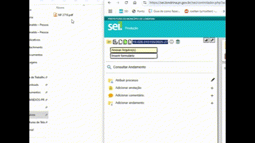

Essa operação de anexar tem as seguintes funções nativas que podem ser aproveitadas;

1- se o arquivo iniciar com "fatura 123" por padrão o tipo do documento externo será "fatura" e o número será "123", esse é um exemplo, isso se existir fatura como documento externo, caso não exista ela tentará selecionar anexo ou anexos se também existir.

2- é possível incluir essas chaves abaixo no nome do arquivo para alterar propriedades do anexo

- ".caa" altera o tipo de conferência para "Cópia Autenticada Administrativamente"
- ".cac" altera o tipo de conferência para "Cópia Autenticada por Cartório"
- ".cs" altera o tipo de conferência para "Cópia Simples"
- ".do" altera o tipo de conferência para "Documento Original"
- ".ip" altera o acesso para restrito e seleciona "Informação pessoal"
- ".28-01-2025" altera a data do documento externo para 28/01/2025
escreva o nome de um arquivo como "fatura 123.caa.ip.25-01-2025" e faça um teste para ver o comportamento

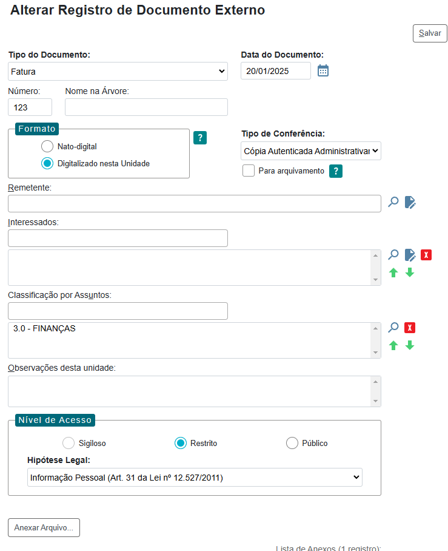

como resultado o anexo vai ter os seguintes valores preenchidos:

1. Tipo do Documento: Fatura
2. Data do Documento: 20/01/2028
3. Número: 123
4. Formato: Digitalizado nesta Unidade
5. Tipo de Conferência: Cópia Autenticada Administrativamente
6. Nível de Acesso: Restrito = Informação Pessoal (Art. 31 da Lei nº 12.527/2011)

Essa é a função básica, confira a seguir as funções avançadas para anexar, criar formulários e gerar processos inteiros em 1 click (modo de falar, mas dois ou três resolvem).


# CONFIGURAÇÕES PARA ARQUIVOS/DOCUMENTOS

A extensão suporta extrair o texto interno dos documentos a partir das seguintes extensões:
- txt/csv/cst/etc...: Arquivos de texto puro
- doc/docx: documento word
- xls/xlsx: planilha Excel
- pdf: arquivo PDF (esse tem uma possibilidade extra de capturar dados pela posição do texto, criando um retângulo em cima do texto que pretende capturar)
- formulário: formulário interno do SEI;


## Objetivo ao criar essas configurações:

- anexar usando somente o nome do arquivo para seleção automática do tipo de anexo;
- coletar dados a partir do texto do arquivo (data, numeroAnexo, nomeArvore, observacoes, outras informações que possam ser utilizadas no preenchimento de formulários, descrição do processo, e-mail etc.)


A coleta de dados ocorre em duas situações:

1. A primeira é usar diretamente o botão "Anexar arquivo(s) (também dropando o arquivo na arvore dos documentos);
2. A segunda é quando ele já foi inserido e é marcado a caixa de seleção, se tiver alguma configuração compatível a extensão vai ler o arquivo e extrair os dados.


Vamos a primeira parte e para seguir o tutorial utilize esse arquivo de modelo: [Modelo NF](arquivos/NF%202718.pdf).

## Anexar utilizando o nome do arquivo e REGEX


Pra utilizar somente o nome do arquivo vamos seguir alguns padrões simples e caso queira se aprofundar na utilização do REGEX para mapear o arquivo todo siga esse tutorial:

[Link para Tutorial REGEX](Tutorial%20REGEX.md)

### Passo a passo - Primeira fase

Vamos definir o que vai a extensão vai executar:

temos o arquivo que abreviamos Nota fiscal pra NF seguido do número dela ("NF 2718.pdf") e queremos que a extensão insira e selecione "Nota Fiscal" e defina "2718" como número do anexo;

Vamos começar: 

Abra Extensão


Entre em Configurar Anexo


Crie um novo anexo


na aba "Propriedades e diretrizes de seleção do anexo" você vai conseguir criar o regex para executar no nome do arquivo que vai identificar qual nome de anexo ele vai usar ao ser carregado no SEI;

Preencha os campos:

- nome: usar uma informação curta para você identificar a configuração para editar, nesse caso vamos usar "Nota Fiscal";

- Anotação/Descrição: informações úteis do anexo, instruções de como gerar o arquivo e assim por diante, vamos deixar essa informação para definir essa configuração: "Seleciona nota fiscal em documentos iniciados com NF";

- Agora configure o campo "Regex" e "Anexo selecionado" para que o regex selecione o anexo desejado dessa forma:

vamos montar o regex para fazer a identificação e capturar o a variável "numeroAnexo"
"`^NF (?<numeroAnexo>\d+\-\d{4})`";

    ^: Indica o início da string. O nome do arquivo deve começar com "NF".

    NF: Literalmente corresponde aos caracteres "NF".

    (espaço): Corresponde a um espaço após "NF".

    (?<numeroAnexo>\d+\-\d{4}): Este é um grupo nomeado chamado numeroAnexo.

        \d+: Corresponde a um ou mais dígitos.

        \-: Corresponde ao caractere hífen "-".

        \d{4}: Corresponde exatamente a quatro dígitos.

    .pdf: Corresponde literalmente aos caracteres ".pdf".

    $: Indica o final da string. O nome do arquivo deve terminar com ".pdf".

    Portanto, o regex completo ^NF (?<numeroAnexo>\d+\-\d{4}).pdf$ corresponde a um nome de arquivo que:

    Começa com "NF".

    Seguido por um espaço.

    Seguido por um número (um ou mais dígitos), um hífen e exatamente quatro dígitos.

    Termina com ".pdf".

    Quando um nome de arquivo corresponde a esse padrão, ele será classificado como "Nota fiscal".

Dessa forma pode-se criar quantas configurações quiser, porem tem que tomar cuidado para que a uma configuração corresponda com o padrão de outra e entrem em conflito

seguindo uma abordagem menos exigente, que copia tudo depois de NF até o primeiro ponto:

"`^NF (?<numeroAnexo>[^\.]+)`" => "Nota fiscal";

    ^: Este símbolo indica o início da string. Significa que a string deve começar com o padrão que segue.

    NF: Este é um texto literal que deve aparecer exatamente como está. Então, a string deve começar com "NF".

    (espaço): Um espaço literal. A string deve ter um espaço após "NF".

    (?<numeroAnexo>[^\.]+): Este é um grupo de captura nomeado. Vamos detalhar cada parte:

    (?<numeroAnexo>...): Define um grupo de captura nomeado chamado numeroAnexo. Isso permite que você acesse o valor capturado por este grupo pelo nome numeroAnexo.

    [^\.]+: Um conjunto de caracteres negados. [^\.] significa "qualquer caractere exceto um ponto (.)". O + indica que deve haver um ou mais desses caracteres.

    Portanto, o regex completo ^NF (?<numeroAnexo>[^\.]+) corresponde a uma string que:

    Começa com "NF"

    Seguido por um espaço

    Seguido por um ou mais caracteres que não sejam um ponto (.), que são capturados no grupo nomeado numeroAnexo.

    Exemplo de correspondência:

    Para a string "NF 12345", o grupo numeroAnexo capturaria "12345".

    Para a string "NF ABCD", o grupo numeroAnexo capturaria "ABCD".

Essa regex é usada para identificar strings que começam com "NF " e capturar o texto que segue, até encontrar um ponto (se houver).

Anexo que será ser selecionado: ser o regex corresponder será selecionado o anexo escolhido aqui, (é possível selecionar vários porem selecionará o primeiro que existir no SEI).

Diferenciar maiúsculas/minúsculas: marque caso queira que 'NF' seja diferente de "nf" no seu regex, nesse caso vamos deixar desmarcado para aceitar tanto NF quanto outras variações como nf, Nf ou nF.

salve e está feito seu primeiro atalho automático, teste nomeando um arquivo "NF 12345" ou "NF 12345-2025" dependendo da sua escolha

### Passo a passo - Segunda fase

Agora que configuramos a primeira aba ("Propriedades e diretrizes de seleção do anexo") vamos criar as propriedades que faltaram, como a data da nota fiscal além de capturar informações pra utilização na criação de um formulário:

Agora abra a aba "Capturas extras - REGEX" para configurar parametrizar alguns dados;

- marque Ler texto do arquivo

- Baixe o arquivo "NF 2718.pdf" e abra ele na extensão para usar como teste;

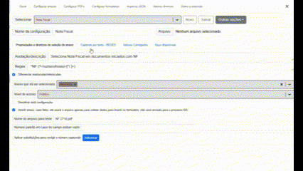

Agora com o texto carregado vamos localizar essa informação no texto para parametrizar o "nome", o "cpf/cnpf" e a "data":

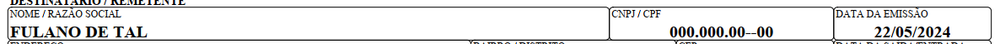

```
...
NOME / RAZÃO SOCIAL CNPJ / CPF  DATA DA EMISSÃO
FULANO DE TAL   000.000.00-00   22/05/2024
...

``` 

agora vamos criar uma captura em branco:


vamos criar um regex para capturar as 3 informações

vamos manter a primeira linha como um identificador para a segunda linha, assim o regex ficará assim:

obs. não é possível visualizar facilmente mas "NOME / RAZÃO SOCIAL",  "CNPJ / CPF" e "DATA DA EMISSÃO" estão sendo separados por uma tabulação e não por um espaço simples e o mesmo ocorre na linha 2 que estão os valores que pretendemos capturar, assim podemos substituir a tabulação pelo caractere "\t",
vamos fazer as substituições

```
NOME / RAZÃO SOCIAL\tCNPJ / CPF\tDATA DA EMISSÃO
FULANO DE TAL\t000.000.00-00\t22/05/2024
```

feito isso vamos criar as capturas:

```
NOME / RAZÃO SOCIAL\tCNPJ / CPF\tDATA DA EMISSÃO
(?<nome>[^\t]+)\t(?<cpfCnpj>[^\t]+)\t(?<data>.+)
```

obs. o texto gerado do arquivo pdf mantém separado por tabulação "\t" textos distantes que ficam na mesma linha, por isso é interessante memorizar essa lógica de regex "`(?<nome>[^\t]+)\t`" pois pode ser bem útil para parametrizar textos linhas de tabelas ou um texto que a linha anterior são os títulos e a linha seguinte são os valores.

agora vamos substituir a quebra de linha pelo seu caractere "\n"

```
NOME / RAZÃO SOCIAL\tCNPJ / CPF\tDATA DA EMISSÃO\n(?<nome>[^\t]+)\t(?<cpfCnpj>[^\t]+)\t(?<data>.+)
```

agora que terminamos o regex para capturar as informações e vamos inserir na captura em branco que criamos e preencha o nome:

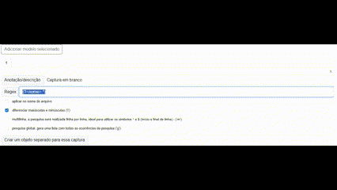

agora vamos repetir o processo e criar para capturar o número da nota:
texto que identifica a nota
```
Nº. 000.002.718
```

```
^Nº. [0\.]*(?<numeroAnexo>[1-9][0-9\.]*)
```

1. `^`: Indica o início da linha. Isso garante que a correspondência ocorra apenas se o padrão estiver no começo da linha. (**marque a opção multilinha para que isso funcione**).
2. `Nº. `: Corresponde literalmente ao texto "Nº. " (com um espaço após o ponto). Este é o prefixo que identifica o número da nota.
3. `[0\.]*`: Corresponde a zero ou mais ocorrências de '0' ou '.'. Isso permite que o número da nota tenha zeros à esquerda e pontos como separadores.
4. `(?<numeroAnexo>[1-9][0-9\.]*)`: Esta é uma captura nomeada chamada `numeroAnexo`.
   - `[1-9]`: Corresponde a qualquer dígito de 1 a 9. Isso garante que o número não comece com zero.
   - `[0-9\.]*`: Corresponde a zero ou mais ocorrências de qualquer dígito (0-9) ou ponto ('.'). Isso permite capturar o restante do número da nota, que pode incluir pontos como separadores.


com isso temos as propriedades nome, cpfCnpj, data e numeroAnexo capturadas do texto do arquivo, abra a aba "Valores carregados" e confira se essas propriedades carregaram com os valores corretamente.

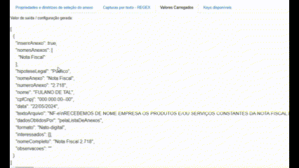

feito isso agora é só salvar

vamos agora configurar um formulário e usar essas informações capturadas

e veja também outra forma de capturar essas informações em "Anexar PDF"


## Anexar PDF

# CONFIGURAÇÕES PARA FORMULÁRIO

Muitos formulários que trabalhamos são como esse abaixo, eles vem quase prontos onde temos que apenas adicionar uma ou outra informação para que fique pronto.

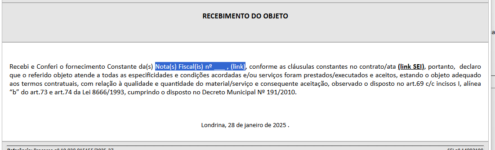

Nesse caso temos que adicionar o número da nota fiscal e o link na parte destacada "Nota(s) Fiscal(is) nº ___ , (link)", portanto vamos definir que essa é a primeira forma de trabalhar com formulário, onde alteramos o "Documento do sistema" conforme nossa necessidade;

A segunda forma é utilizar um "Texto padrão" para substituir o corpo principal da mensagem e deixa-lo conforme nossa necessidade, mas esse método se restringe apenas ao corpo, geralmente cabeçalhos e rodapés não são possíveis utilizar o texto padrão;

A terceira forma de trabalhar com formulário é criar um modelo a partir do original e utilizar o seu número, essa forma permite personalizar tanto o cabeçalho quanto o rodapé;

Obs. ao trabalhar com a primeira forma é possível editar tanto o cabeçalho quanto o rodapé, mas desde que esteja liberado pois a maioria dos formulários só deixam disponível alterar o corpo da mensagem.

Dicas. 
 1. criando uma biblioteca de modelos com texto padrão ficará restrito apenas a sua unidade;
 2. criando uma biblioteca de modelos a partir de um processo SEI, assinando os modelos e deixando público eles ficarão disponíveis para outras unidades;
 3. criando uma biblioteca de modelos a partir de um processo SEI, deixar os modelos sem assinatura fará com que os modelos fiquem disponíveis apenas para a unidade atual, mas permitirá fazer alterações;
 4. trabalhando com o "Documento do sistema" será mais trabalhoso, mas não terá as restrições acima.

Vamos aproveitar o trabalho que fizemos para parametrizar a nota fiscal 2718 feita no menu "Anexar utilizando - REGEX" e vamos trabalhar com a primeira forma, utilizar o "Documento do sistema" e fazer as edições pontualmente;

Vou utilizar o formulário "Contratos: Recebimento do Objeto", fique a vontade para utilizar outro caso não exista e assim seguir o tutorial.
 
## Passo 1 - Abra a tela de formulários e crie um novo formulário:

 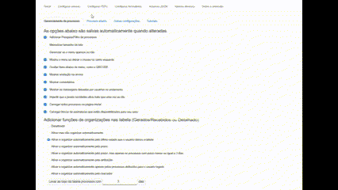

No campo: "Nome da configuração" Insira um nome para a configuração do Formulário, vou utilizar o próprio nome do formulário: "Contratos: Recebimento do Objeto"

## Passo 2 - Na aba "informações básicas" preencha
- Formulário: selecione um formulário ("Contratos: Recebimento do Objeto");
- Nome na arvore: preencha caso queira deixar uma informação extra no nome do formulário; normalmente deixo vazio mas vou deixar com a lista de nota selecionadas para verem o resultado "`[[LISTA_POR_EXTENSO_REDUZIDA_SEM_LINK]]`"
- Nível de acesso: selecione o nível de acesso;
- Observações: preencha caso queira incluir observações no formulário; normalmente deixo vazio mas vamos adicionar um texto para ver o resultado "`criado por: [[NOME_USUARIO]], documento: [[nomeCompleto]], [[cpfCnpj]], [[nome]]`"
- Selecione entre "Documento do sistema" ou "Número modelo" ou "Texto padrão"; nesse caso deixe marcado "Documento do sistema";

## Passo 3 - Na aba "informações da extensão" preencha:

- Descreva o que o formulário faz para quando o mouse estiver em cima: Escreva "recebimento do Objeto:\n\t selecione pelo menos uma nota fiscal para gerar o formulário"
- Selecione quais documentos selecionados que ativará esse formulário: Escolha o anexo que você quer que o formulário apareça, no meu caso vou escolher "Nota Fiscal"
- Selecione a quantidade mínima de anexos para ativar o formulário: se o seu formulário precisar de mais de um tipo de anexo coloque a quantidade aqui, ele irá bloquear a inserção do formulário se não atingir essa quantidade mínima; mas vou deixar 0;
- Adicione uma cor para o botão;
- Filtrar anexos que serão usados na sua edição; por exemplo na arvore tenho 2 anexos, um boleto e uma nota fiscal, no formulários temos disponíveis algumas listas de anexos selecionados como `[[LISTA_POR_EXTENSO_REDUZIDA]]`, se adicionarmos essa lista no texto que vamos substituir a frente "`Nota(s) Fiscal(is) nº ___ , (link)`" assim "`Nota(s) Fiscal(is) [[LISTA_POR_EXTENSO_COMPLETA]]`" vamos ter o boleto como intruso nessa lista, a lista ficará assim "`Nota(s) Fiscal(is) Nota Fiscal 2.718 (1423422) e Boleto 4654 (1423436)`", para que isso não ocorra insira apenas a "Nota Fiscal" nesse filtro;
- Atalho gerar formulário - defina se essa configuração se ativará ou não, padrão é ativar; deixe ativado
- Sempre mostrar formulário - marque se quiser que o atalho fique sempre ativo; deixe desativado pois o intuito do formulário aparecer somente quando selecionarmos a nota fiscal;

## Passo 4 - Agora entre na aba "Pesquisar, substituir, remover ou adicionar texto no modelo":

 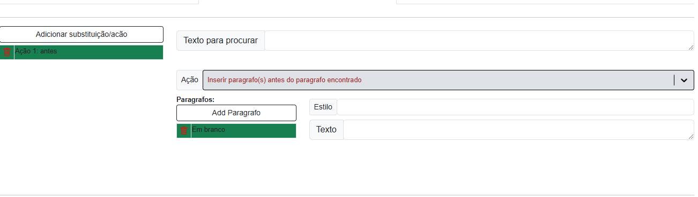

 Utilize o botão "Adicionar substituição/ação" na coluna da esquerda para criar quantas substituições precisar, por enquanto vamos realizar somente uma substituição

 1. no campo "Texto para Procurar" adicione o texto que queremos substituir `Nota(s) Fiscal(is) nº ___ , (link)`
 2. no campo "Ação" selecione "`Substituir apenas o texto encontrado`"
 3. no campo "Substituir por" adicione o texto que substituirá o valor inicial, vamos colocar esse valor no campo "`Nota(s) Fiscal(is) [[LISTA_POR_EXTENSO_COMPLETA]]`" (confira outros formatos de lista e valores [aqui](valores_formulario.md))
 4. tem opção de alterar o estilo do parágrafo, nesse caso vamos selecionar o que dá espaçamento na primeira linha "Texto_Justificado_Recuo_Primeira_Linha";

Agora salve a configuração 

 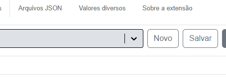

Agora vamos testar se a configuração está funcionando corretamente:

entre no SEI que testou a configuração da nota fiscal marque ela para ver se aparece a opção de criar o formulário "Contratos: Recebimento do Objeto".

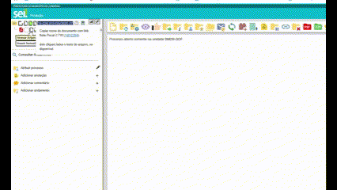

Testado e funcionando, o atalho para gerar o anexo "Contratos: Recebimento do Objeto" agora aparece somente quando seleciono "Nota Fiscal".

Voltando ao início, vai ser esse mesmo processo para trabalhar com "Número modelo" ou "Texto padrão", a única coisa que diferencia vai ser que tanto no modelo quanto no texto padrão voce poderá utilizar as propriedades como `[[LISTA_POR_EXTENSO_COMPLETA]]` diretamente no modelo, sem precisar criar uma substituição de parte do texto.

Com isso está feito um atalho para gerar um formulário.

# CONFIGURAÇÕES PARA PROCESSOS

## Processos relacionados 

 

## Descrição do processo 

 

# PREENCHIMENTO DE E-MAIL

 
# DISPONIBILIZANDO ACESSO EXTERNO EM LOTE

 

# VERIFICAR CIÊNCIA EM LOTE

 

# GERENCIAR DOCUMENTOS UTILIZANDO O FILTRO

 

# NOTIFICAÇÕES BLOCOS DE ASSINATURA

 

# OPÇÕES CAIXA DE SELEÇÃO DE DOCUMENTOS

 

# ATIVANDO FUNÇÕES EXTRAS MENU

 

 

 

