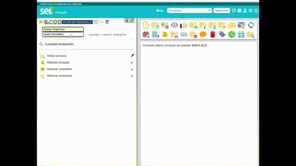
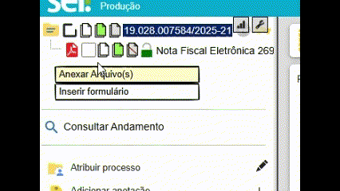
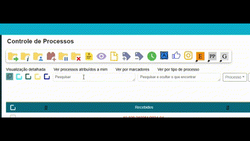
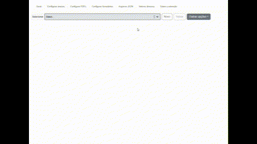
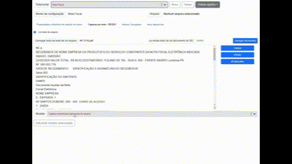

# Sumário

- [VISÃO GERAL](#visão-geral)
- [O QUE IRÁ APRENDER](#o-que-irá-aprender)
- [PARAMETRIZANDO ARQUIVOS E DOCUMENTOS](#parametrizando-arquivos-e-documentos)
    - [Conhecendo Regex e como utilizar para extrair os dados](#conhecendo-regex-e-como-utilizar-para-extrair-os-dados)
    - [Tutorial REGEX](#tutorial-regex)
    - [Palavras Chaves de Pesquisa com Regex (JavaScript)](#palavras-chaves-de-pesquisa-com-regex-javascript)
    - [Escapando Caracteres Especiais em Regex](#escapando-caracteres-especiais-em-regex)
    - [Guia Completo de Expressões Regulares](#guia-completo-de-expressões-regulares)
    - [Utilizando Grupos para Captura Nomeada](#utilizando-grupos-para-captura-nomeada)
- [CRIANDO CONFIGURAÇÕES](#criando-configurações)
    - [Anexar utilizando - REGEX](#anexar-utilizando---regex)
    - [Anexar PDF](#anexar-pdf)
    - [Formulários](#formulários)
    - [Processos](#processos)
    - [Processos relacionados](#processos-relacionados)
    - [Descrição do processo](#descrição-do-processo)
    - [E-mail](#e-mail)
- [OUTRAS FUNÇÕES](#outras-funções)
- [Disponibilizando acesso externo em lote a um documento/processo](#disponibilizando-acesso-externo-em-lote-a-um-documentoprocesso)
- [Verificando ciência de servidores a um determinado processo](#verificando-ciência-de-servidores-a-um-determinado-processo)
- [Utilizando a barra de pesquisa e filtros](#utilizando-a-barra-de-pesquisa-e-filtros)
- [Ativando alerta de blocos de assinatura disponibilizados para o setor](#ativando-alerta-de-blocos-de-assinatura-disponibilizados-para-o-setor)
- [Utilizando a caixa de se seleção para copiar dados](#utilizando-a-caixa-de-se-seleção-para-copiar-dados)
- [Ativando funções da extensão](#ativando-funções-da-extensão)


# VISÃO GERAL 

A extensão “SEI-ANEXOS” apresenta uma série de ferramentas desenvolvidas para aumentar e padronizar a produtividade no ambiente de produção do Sistema Eletrônico de Informações (SEI). 

O seu funcionamento se baseia em parametrizar os dados dos documentos (doc, xls, xlsx, pdf, txt, csv, etc.) para utilizá-los na automatização de funções como: anexar, preencher formulário, preencher Email etc. 

Com isso, o objetivo é elevar os procedimentos realizados no SEI a outro nível, garantindo eficiência e consistência nas atividades diárias. Por meio da implementação dessas ferramentas para parametrizar os dados e como utilizar, espero ensinar o básico para que possa utilizar a extensão a fim de padronizar documentos e consequentemente, aprimorar a qualidade do serviço prestado. 

Você terá liberdade para adotar as melhores práticas que considerar para o seu setor do SEI, alinhando as necessidades específicas dos usuários do SEI. 

 

# O QUE IRÁ APRENDER 

Parametrizar arquivos e documentos para extrair dados; 

Criar configurações aproveitando os dados para: 

- inserir formulários;

- criar processo SEI;

- gerar processo relacionado;

- reescrever a descrição do processo;

- enviar e-mail;

 

Utilizar outras funções como: 

- disponibilizar acesso externo em lote a um documento/processo;

- verificar ciência de servidores a um determinado processo;

- utilizar a barra de pesquisa e filtros de processos e organizar a tabela;

- ativar/desativar alerta de blocos de assinatura disponibilizados para o setor;

- utilizar a caixa de seleção para copiar dados;

- desativar/ativar funções da extensão;

 

 
# PARAMETRIZANDO ARQUIVOS E DOCUMENTOS 

Parametrizar dados utilizando expressões regulares - REGEX; 

 

## Conhecendo Regex e como utilizar para extrair os dados 


Se já está habituado com REGEX, basta utilizar os grupos nominados "`(?<nomeDaVariavel>...)`" e lembrar que essas variaveis abaixo são essenciais no preenchimento da tela anexo:

- numeroAnexo (preenche o número)

- nomeArvore (preenche o nome na arvore)

- data (preenche a data)

- observacoes (preenche observações da unidade)

As utilizações serão feitas no nome do arquivo ou no texto dele ou ambos, conforme vai ser 

### Tutorial REGEX

Texto como exemplo: “número do empenho: 1566/2025 Valor do empenho: R$ 150,00 Data do empenho: 02/01/2025” 

Nesse trecho temos duas informações importantíssimas para o formulário (data e número) e uma (valor) que pode ser mapeada para futura utilização num formulário por exemplo; 

Para mapear, vamos utilizar uma pesquisa genérica chamada expressão regular. Por exemplo, se pesquisarmos o texto “número do empenho: 1566/2025” no Word, ele encontrará o texto e o destacará. Isso é uma pesquisa direta, pois sabemos o valor exato a ser encontrado. Agora, como podemos fazer essa pesquisa de forma que ela seja dinâmica e encontre qualquer número, independentemente do valor?

Para deixar dinâmico a captura desse texto vamos criar um molde de pesquisa utilizando a expressão regular: 

Antes vamos conhecer algumas palavras chaves para utilizar na pesquisa; 

\d : captura um único número de 0-9; exemplo "abc123def456", pesquisando com esse termo vai localizar apenas o primeiro numero ou seja o valor "1"

\d+ : captura uma cadeia de números de 0-9, pelo menos um número é necessário para a pesquisa funcionar;  pesquisando com esse termo vai localizar a primeira cadeia de números ou seja vai capturar o valor "123";

Nesse início vemos que a letra d dessa palavra chave “\d” se refere a um grupo de decimais, existem outros grupos como “\w” word (letras), “\s” space (espaço comum, tabulação, quebra de página), veja no final mais palavras chaves; 

Agora vamos desenvolver uma pesquisa dinâmica com essas palavras chaves em cima da pesquisa direta que trabalhamos acima: "número do empenho: 1566/2025";

vamos convencionar que apenas queremos que o número 1566 seja dinamico na pesquisa, assim vamos preservar uma estrura para a pesquisa e trocar apenas o número 1566 pela palavra chave de números decimais \d "número do empenho: \d+/2025", pense nisso como uma ordem dada ao sistema assim: (localize o texto  "número do empenho: " seguido de números e seguido do texto "/2025"!).

Nesse exemplo fizemos uma pesquisa dinamica para o número 1566, agora vamos ao passo seguinte, que é riar a captura utilizando e dar um nome ao valor: 

Vamos definir que o número 1566/2025 vai ser o número do anexo no SEI que preenchemos ao anexar um arquivo.

até então temos a nossa pesquisa "número do empenho: \d+/2025", a informação que é útil para nós é o número do anexo "\d+/2025";

obs. na extensão a chave do valor que preenche o número do anexo é a "numeroAnexo"

Para capturar essa informação da pesquisa montada vamos circular ela com esse molde: “`(?<chave>informação a ser capturada)`” e ela ficará assim "número do empenho: `(?<numeroAnexo>\d+/2025)`"

com isso criamos a primeira captura para definir o número do anexo;


#### Palavras Chaves de Pesquisa com Regex (JavaScript)

Aqui estão algumas palavras chaves de pesquisa utilizando expressões regulares compatíveis com JavaScript:

- `\d` : Captura um único dígito (0-9).

- `\d+` : Captura uma sequência de um ou mais dígitos.

- `\w` : Captura um caractere alfanumérico (letras e números) ou underscore (_).

- `\w+` : Captura uma sequência de um ou mais caracteres alfanuméricos ou underscores.

- `\s` : Captura qualquer caractere de espaço em branco (espaço, tabulação, quebra de linha).

- `\S` : Captura qualquer caractere que não seja espaço em branco.

- `.` : Captura qualquer caractere, exceto quebras de linha.

- `.*` : Captura zero ou mais ocorrências de qualquer caractere, exceto quebras de linha.

- `^` : Indica o início de uma linha.

- `$` : Indica o final de uma linha.

- `\b` : Captura uma borda de palavra (início ou fim de uma palavra).

- `\B` : Captura uma posição que não seja uma borda de palavra.

- `[abc]` : Captura qualquer caractere dentro dos colchetes. Por exemplo, `[abc]` captura 'a', 'b', ou 'c'.

- `[a-z]` : Captura qualquer caractere de 'a' a 'z'.

- `[A-Z]` : Captura qualquer caractere de 'A' a 'Z'.

- `[0-9]` : Captura qualquer dígito de '0' a '9'.

- `[a-zA-Z0-9]` : Captura qualquer caractere alfanumérico.

- `[^abc]` : Captura qualquer caractere que não seja 'a', 'b', ou 'c'.

- `[^a-z]` : Captura qualquer caractere que não esteja entre 'a' e 'z'.

- `[^A-Z]` : Captura qualquer caractere que não esteja entre 'A' e 'Z'.

- `[^0-9]` : Captura qualquer caractere que não seja um dígito de '0' a '9'.

- `[^a-zA-Z0-9]` : Captura qualquer caractere que não seja alfanumérico.


Exemplos de uso:

- Capturar um número de telefone no formato (43) 99456-7890:

    ```regex

    (?<telefone>\(\d{2}\) \d{5}-\d{4})

```

- Capturar um endereço de email:

```regex

(?<email>[a-zA-Z0-9._%+-]+@[a-zA-Z0-9.-]+\.[a-zA-Z]{2,})

```

- Capturar uma data no formato DD/MM/YYYY:

```regex

(?<data>\d{2}/\d{2}/\d{4})

```

- Capturar um CPF no formato 123.456.789-00:

    ```regex

    (?<CPF>\d{3}\.\d{3}\.\d{3}-\d{2})

    ```

- Capturar um CNPJ no formato 12.345.678/0001-00:

    ```regex

    (?<CNPJ>\d{2}\.\d{3}\.\d{3}/\d{4}-\d{2})

    ```

lembrando que sempre que possível utilize parte do texto que vem antes ou depois, caso esses sejam úteis para determinar com precisão o valor que vai capturar, por exemplo:

- Capturar um CNPJ no formato 12.345.678/0001-00:

    ```regex

    CNPJ: (?<CNPJ>\d{2}\.\d{3}\.\d{3}/\d{4}-\d{2})

    ```

se o CNPJ sempre vier com "CNPJ: " antes do número, procure utilizar esse texto antes a seu favor.

#### Escapando Caracteres Especiais em Regex

Em expressões regulares, alguns caracteres têm significados especiais e precisam ser escapados com uma barra invertida (`\`) para serem usados literalmente. Aqui estão alguns exemplos:

- `\[` : Escapa o caractere de colchete esquerdo `[`.

- `\]` : Escapa o caractere de colchete direito `]`.

- `\(` : Escapa o caractere de parêntese esquerdo `(`.

- `\)` : Escapa o caractere de parêntese direito `)`.

- `\{` : Escapa o caractere de chave esquerda `{`.

- `\}` : Escapa o caractere de chave direita `}`.

- `\.` : Escapa o ponto `.`.

- `\*` : Escapa o asterisco `*`.

- `\+` : Escapa o sinal de mais `+`.

- `\?` : Escapa o ponto de interrogação `?`.

- `\\` : Escapa a barra invertida `\`.

- `\|` : Escapa a barra vertical `|`.

- `\^` : Escapa o acento circunflexo `^`.

- `\$` : Escapa o cifrão `$`.

Exemplo de uso:

- Para capturar um texto que contém colchetes, como `[exemplo]`:

    ```regex

    \[exemplo\]

    ```

Esses caracteres especiais precisam ser escapados para serem interpretados literalmente em uma expressão regular.

#### Guia Completo de Expressões Regulares

Para um guia completo e detalhado sobre expressões regulares, você pode consultar o seguinte link:

[Guia Completo de Expressões Regulares (MDN Web Docs)](https://developer.mozilla.org/pt-BR/docs/Web/JavaScript/Guide/Regular_Expressions)

Este guia fornece uma visão abrangente sobre o uso de expressões regulares em JavaScript, incluindo exemplos práticos e explicações detalhadas.


#### Utilizando Grupos para Captura Nomeada

O foco principal ao trabalhar com expressões regulares na extensão é a utilização de grupos para capturar informações específicas de forma nomeada.

Por exemplo, considere a expressão regular `(?<chave>\d\w[a-z]+)`. Aqui está o que cada parte faz:

- `(?<chave>...)` : Define um grupo de captura nomeada chamado `chave`.

- `\d` : Captura um único dígito (0-9).

- `\w` : Captura um caractere alfanumérico (letras e números) ou underscore (_).

- `[a-z]+` : Captura uma sequência de um ou mais caracteres de 'a' a 'z'.

Essa expressão regular captura um dígito seguido por um caractere alfanumérico e uma sequência de letras minúsculas, e armazena o resultado no grupo nomeado `chave`.

Vamos aplicar isso em um exemplo prático. Suponha que queremos capturar um número de identificação seguido por uma palavra:

Texto: "ID123abc"

Expressão Regular: `ID(?<id>\d\w[a-z]+)`

Aplicando a expressão regular ao texto, o grupo nomeado `id` capturará "123abc".


 

# CRIANDO CONFIGURAÇÕES 

 

## Anexar utilizando - REGEX

### Objetivo:

- anexar usando somente o nome do arquivo para seleção automática do tipo de anexo;

- coletar dados a partir do texto do arquivo (data, numeroAnexo, nomeArvore, observacoes, outras informações que possam ser utilizadas no preenchimento de formulários, descrição do processo, e-mail etc.)

Observações: 

A coleta de dados vai ocorre em duas situações:

A primeira é quando usar diretamente o botão "Anexar arquivo(s) (também dropando o arquivo na arvore dos documentos);

Caso não tenha um arquivo de nota fiscal para seguir, utilize esse arquivo de modelo: [Modelo NF](arquivos/NF%20123.pdf)





A segunda é quando ele já foi inserido e é marcado a caixa de seleção, se tiver alguma configuração compatível a extensão vai ler o arquivo e extrair os dados.





### Passo a passo - Primeira fase

Vamos definir o que vai a extensão vai executar:

temos o arquivo que abreviamos Nota fiscal pra NF seguido do número dela ("NF 123.pdf") e queremos que a extensão insira e selecione "Nota Fiscal" e defina "123" como número do anexo;

Vamos começar: 

Abra Extensão



Entre em Configurar Anexo


Crie um novo anexo



na aba "Propriedades e diretrizes de seleção do anexo" voce vai conseguir criar o regex para executar no nome do arquivo que vai identificar qual nome de anexo ele vai usar ao ser carregado no SEI;

Preencha os campos:

- nome: usar uma informação curta para você identificar a configuração para editar;

- Anotação/Descrição: informações úteis do anexo, instruções de como gerar o arquivo e assim por diante;

- Agora configure os campos Regex e Anexo selecionado para que o regex selecione o anexo desejado dessa forma:

vamos montar o regex para fazer a identificação e capturar o a variavel "numeroAnexo"
"`^NF (?<numeroAnexo>\d+\-\d{4}).pdf$" => "Nota fiscal`";

    ^: Indica o início da string. O nome do arquivo deve começar com "NF".

    NF: Literalmente corresponde aos caracteres "NF".

    (espaço): Corresponde a um espaço após "NF".

    (?<numeroAnexo>\d+\-\d{4}): Este é um grupo nomeado chamado numeroAnexo.

        \d+: Corresponde a um ou mais dígitos.

        \-: Corresponde ao caractere hífen "-".

        \d{4}: Corresponde exatamente a quatro dígitos.

    .pdf: Corresponde literalmente aos caracteres ".pdf".

    $: Indica o final da string. O nome do arquivo deve terminar com ".pdf".

    Portanto, o regex completo ^NF (?<numeroAnexo>\d+\-\d{4}).pdf$ corresponde a um nome de arquivo que:

    Começa com "NF".

    Seguido por um espaço.

    Seguido por um número (um ou mais dígitos), um hífen e exatamente quatro dígitos.

    Termina com ".pdf".

    Quando um nome de arquivo corresponde a esse padrão, ele será classificado como "Nota fiscal".

Dessa forma pode-se criar quantas configurações quiser, porem tem que tomar cuidado para que a uma configuração corresponda com o padrão de outra e entrem em conflito

seguindo uma abordagem menos exigente, que copia tudo depois de NF até o primeiro ponto:

"`^NF (?<numeroAnexo>[^\.]+)`" => "Nota fiscal";

    ^: Este símbolo indica o início da string. Significa que a string deve começar com o padrão que segue.

    NF: Este é um texto literal que deve aparecer exatamente como está. Então, a string deve começar com "NF".

    (espaço): Um espaço literal. A string deve ter um espaço após "NF".

    (?<numeroAnexo>[^\.]+): Este é um grupo de captura nomeado. Vamos detalhar cada parte:

    (?<numeroAnexo>...): Define um grupo de captura nomeado chamado numeroAnexo. Isso permite que você acesse o valor capturado por este grupo pelo nome numeroAnexo.

    [^\.]+: Um conjunto de caracteres negados. [^\.] significa "qualquer caractere exceto um ponto (.)". O + indica que deve haver um ou mais desses caracteres.

    Portanto, o regex completo ^NF (?<numeroAnexo>[^\.]+) corresponde a uma string que:

    Começa com "NF"

    Seguido por um espaço

    Seguido por um ou mais caracteres que não sejam um ponto (.), que são capturados no grupo nomeado numeroAnexo.

    Exemplo de correspondência:

    Para a string "NF 12345", o grupo numeroAnexo capturaria "12345".

    Para a string "NF ABCD", o grupo numeroAnexo capturaria "ABCD".

Essa regex é usada para identificar strings que começam com "NF " e capturar o texto que segue, até encontrar um ponto (se houver).

Anexo que será ser selecionado: ser o regex corresponder será selecionado o anexo escolhido aqui, (é possível selecionar vários porem selecionará o primeiro que existir no SEI).

Diferenciar maiúsculas/minúsculas: marque caso queira que 'NF' seja diferente de "nf" no seu regex.


salve e está feito seu primeiro atalho automático, teste nomeando um arquivo "NF 12345" ou "NF 12345-2025" dependendo da sua escolha

### Passo a passo - Segunda fase

Agora que configuramos a primeira aba ("Propriedades e diretrizes de seleção do anexo") vamos criar as propriedades que faltaram, como a data da nota fiscal além de capturar informações pra utilização na criação de um formulário:

Agora abra a aba "Capturas extras - REGEX" e insira um modelo em branco:





## Anexar PDF

## Formulários 

 

## Processos 

 

## Processos relacionados 

 

## Descrição do processo 

 

## E-mail 

 

# OUTRAS FUNÇÕES 

 

# Disponibilizando acesso externo em lote a um documento/processo 

 

# Verificando ciência de servidores a um determinado processo 

 

# Utilizando a barra de pesquisa e filtros 

 

# Ativando alerta de blocos de assinatura disponibilizados para o setor 

 

# Utilizando a caixa de se seleção para copiar dados 

 

# Ativando funções da extensão 

 

 

 
